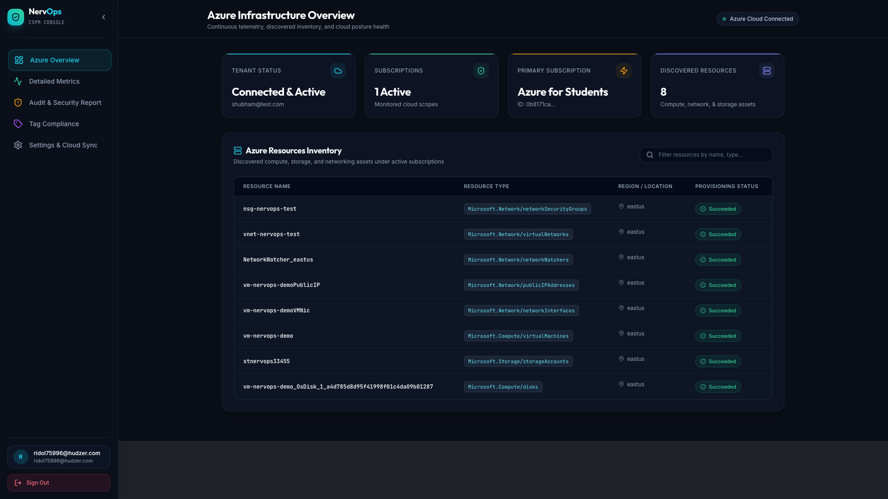
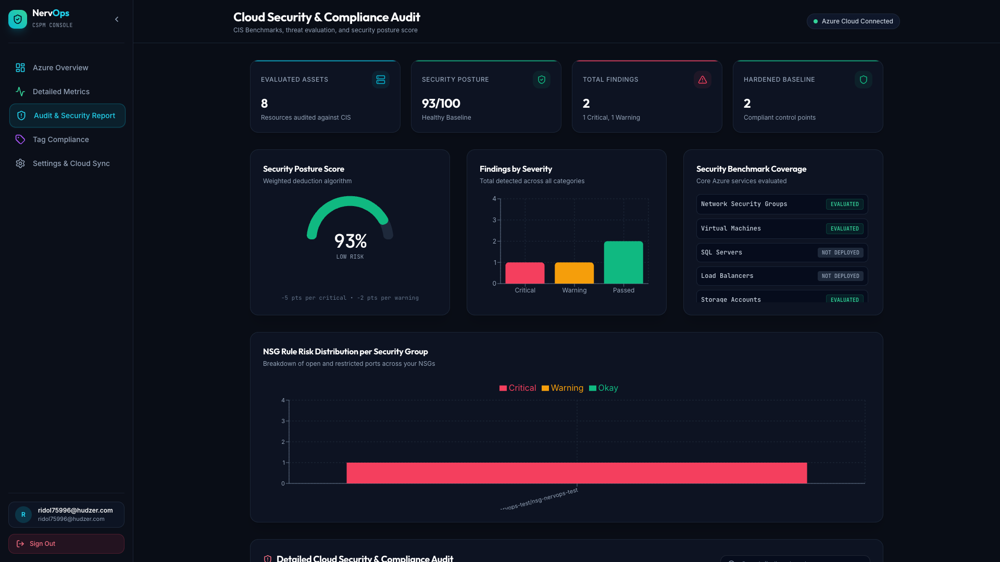
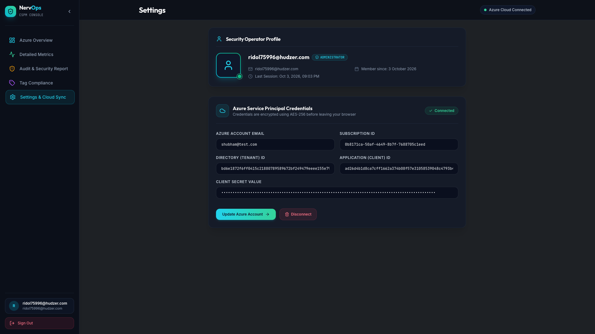

# ⚡ UptimeFury — SysAdmin & DevOps Server Diagnostics Suite

[](https://uptimefury.shubham-aggarwal.com/)
[](https://react.dev/)
[](https://vitejs.dev/)
[](https://tailwindcss.com/)
[](https://hub.docker.com/r/shubhamaggarwal828/uptime-monitor-backend)

> A modern, developer-first diagnostic workbench built for Systems Administrators, SREs, and Network Engineers. Benchmark live server latency, perform asynchronous TCP socket audits, inspect global Anycast DNS propagation, analyze HTTP security posture, and inspect BGP autonomous systems.

---

## 📸 Screenshots & UI Showcase

### 1. Unified Overview Hub


### 2. HTTP Security Posture & Vulnerability Audit


### 3. SysOps Settings Vault & Probe Manager


---

## 🚀 Diagnostic Blades & Features

- **⚡ ICMP Raw Ping & Packet Loss:** Transmit raw socket packets to benchmark round-trip latency, packet loss, and jitter with dynamic node health.
- **🛡️ TCP Port Scanner:** Scan 25 standardized service ports (SSH, HTTP, HTTPS, MySQL, Redis, DNS) or customized port lists with sub-second socket timeouts.
- **🔒 Security Headers Audit:** Grade HTTP security posture (A+ through F) against HSTS, CSP, X-Frame-Options, and copy instant Nginx/Apache configuration fixes.
- **🌐 Global DNS Propagation Grid:** Query 8 authoritative anycast recursive resolvers (Google, Cloudflare, Quad9, OpenDNS, etc.) in parallel to verify cache consensus.
- **🌍 BGP / ASN Route Inspector:** Trace Autonomous System Numbers (ASNs), broadcast prefixes, and localized peering ISP providers.
- **🔐 TLS / SSL Certificate Inspector:** Intercept live X.509 certificate chains, root Certificate Authorities (Let's Encrypt, DigiCert, Google Trust Services), and expiry dates.
- **📜 Authoritative DNS Zone Query:** Validate A, AAAA, MX, NS, TXT, CAA, and SOA records.
- **📡 Hop-by-Hop Traceroute:** Identify packet loss and routing bottlenecks across autonomous systems.
- **📑 WHOIS Domain Registration Ledger:** Retrieve registration details, registrars, nameserver delegations, and domain expiration timestamps.
- **🔥 Instant Backend Warmup:** Built-in silent background health probe ensures serverless / sleeping backend containers (Render) are awake before users initiate tests.

---

## 🛠️ Tech Stack
- **Framework:** [React 18](https://react.dev/) with [Vite](https://vitejs.dev/)
- **Styling:** Vanilla Tailwind CSS + Glassmorphism Dark Theme (`#07090e`)
- **Icons:** [Lucide React](https://lucide.dev/)
- **Animations:** [Framer Motion](https://www.framer.com/motion/)
- **Routing:** React Router v6
- **HTTP Client:** Axios

---

## 💻 Local Development Setup

### 1. Clone Repository
```bash
git clone https://github.com/shubhamaggarwal828/uptime-fury.git
cd uptime-fury
```

### 2. Install Dependencies
```bash
npm install
```

### 3. Environment Configuration
Create a `.env` file in the root directory:
```env
VITE_API_URI_FOR_METRICS=http://localhost:5012
VITE_QUICK_METRICS_API_ENDPOINT=http://localhost:5012/api/quickStats
VITE_SSL_STATS_API_ENDPOINT=http://localhost:5012/api/ssl-info
VITE_PING_DATA_STATS_API_ENDPOINT=http://localhost:5012/api/ping
VITE_HTTP_STATS_API_ENDPOINT=http://localhost:5012/api/HTTPStats
VITE_FULL_WHOIS_DATA_STATS_API_ENDPOINT=http://localhost:5012/api/whoisDataComplete
VITE_TRACEROUTE_DATA_STATS_API_ENDPOINT=http://localhost:5012/api/traceroute
VITE_NSLOOKUP_DATA_STATS_API_ENDPOINT=http://localhost:5012/api/nslookup
VITE_DNS_LOOKUP_DATA_STATS_API_ENDPOINT=http://localhost:5012/api/dnslookup
```

### 4. Start Vite Dev Server
```bash
npm run dev
```
Open **`http://localhost:5174`** (or your local Vite port) in your browser.

---

## ☁️ Deployment Guide

### Deploy to Vercel (100% Free)
1. Import repository `shubhamaggarwal828/uptime-fury` into [Vercel](https://vercel.com).
2. Framework Preset: **Vite**.
3. Build Command: `npm run build`.
4. Output Directory: `dist`.
5. Add Environment Variable:
   - `VITE_API_URI_FOR_METRICS`: `https://uptime-monitor-backend-latest.onrender.com` (or your backend URL).
6. Click **Deploy**. Client-side routing is automatically supported via [`vercel.json`](vercel.json).

---

## 📄 License
MIT License © 2024–2026 Shubham Aggarwal.
